  

<h3 align="center">
  Backend Developer | Cloud Native Enthusiast | Researcher
</h3>

  

---

### 👨‍💻 About Me 👀

- 📫 找到我: `oisroy233@gmail.com`

---

### 📊 GitHub Analytics

  

 

  
  

 

  
  

 

  

